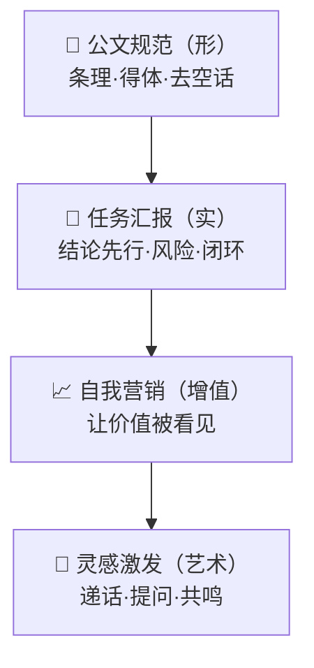

# 18 README 华丽元素方案

> 状态：草稿（待对齐） ｜ 最后更新：打包阶段
>
> 目的：把"业界最华丽的 README 元素"系统化地列全，给出**工具、实现方式、对本项目的推荐度**，最后给出"必备版 / 拉满版"两套选型与素材清单。
>
> 占位约定：下文 URL 中的 `OWNER/REPO` 替换为真实的 GitHub `用户名/仓库名`。

## 0. 设计理念（重要）

本项目本身就是"自我营销 Skill"，**README 就是它最好的现场演示**——README 要亲自示范"结论先行、价值说人话、前后对比、让人一眼想用"。**门面即产品。**

---

## 1. 元素总览（速查表）

| 类别 | 元素 | 工具 / 服务 | 难度 | 本项目推荐度 |
| --- | --- | --- | --- | --- |
| 顶部 Hero | Logo / Banner 横幅 | 自制 / capsule-render | 中 | ★★★★★ |
| 顶部 Hero | 打字动画标语 | readme-typing-svg | 低 | ★★★★ |
| 徽章 | 静态徽章（License/版本等） | shields.io | 低 | ★★★★★ |
| 徽章 | 动态徽章（Stars/Issues等） | shields.io（GitHub API） | 低 | ★★★★ |
| 徽章 | CI 状态 | GitHub Actions badge | 中 | ★★★ |
| 动态展示 | 演示 GIF | ScreenToGif / Kap / Gifski | 中 | ★★★★★ |
| 动态展示 | 终端录制（可复现） | charmbracelet/vhs、asciinema | 中 | ★★★★ |
| 动态展示 | 前后对比 | 并排 GIF / 双栏表格 | 中 | ★★★★★ |
| 宣传片 | Hero 视频 | GitHub 上传 mp4 / YouTube | 高 | ★★★ |
| 宣传片 | 社交预览图 (OG) | 自制 1280×640 图 | 中 | ★★★★ |
| 图解 | Mermaid 图（四层模型） | GitHub 原生 Mermaid | 低 | ★★★★★ |
| 结构 | 目录 TOC | 手写 / 自动生成 | 低 | ★★★★ |
| 结构 | 折叠区块 `<details>` | 原生 HTML | 低 | ★★★★ |
| 结构 | 对比表格 | Markdown 表 | 低 | ★★★★★ |
| 结构 | 路线图勾选 | Markdown checkbox | 低 | ★★★ |
| 社交证明 | Star 增长曲线 | star-history.com | 低 | ★★★★ |
| 社交证明 | 贡献者墙 | contrib.rocks | 低 | ★★★ |
| 社交证明 | 访问量徽章 | komarev / visitor-badge | 低 | ★★ |
| 赞助 | Sponsor 按钮 | `.github/FUNDING.yml` | 低 | ★★ |
| 美化 | 章节分隔/页脚 | capsule-render / SVG 波浪 | 低 | ★★★ |
| 美化 | 表情与图标 | emoji / simple-icons | 低 | ★★★ |
| 国际化 | 中英双语切换 | 顶部语言链接 | 中 | ★★★ |
| 导航 | 回到顶部 | 锚点链接 | 低 | ★★ |

---

## 2. 顶部 Hero 区（第一屏决定去留）

### 2.1 居中布局（HTML in Markdown）
```html
<div align="center">
  
  <h1>向上汇报体 · report-to-boss</h1>
  <p><b>让 AI 像靠谱下属一样汇报，而不是甩给你一堆流水账。</b></p>
  <!-- 徽章放这里 -->
</div>
```

### 2.2 Banner 横幅（两种方式）
- **自制图**：用 Figma/Canva 画一张 1280×320 的横幅，放 `assets/banner.png`。
- **动态生成**：capsule-render（无需自己画图）：
```markdown

```

### 2.3 打字动画标语（readme-typing-svg）
```markdown

```

---

## 3. 徽章（Badges）

全部基于 [shields.io](https://shields.io)。直接用 Markdown 图片语法贴。

### 3.1 静态/项目徽章
```markdown


```

### 3.2 动态徽章（自动读 GitHub 数据）
```markdown


```

### 3.3 CI / 质量徽章（若启用 Actions）
```markdown

```

> 建议：徽章**精选 5–8 个**即可（License / Version / PRs Welcome / Stars / Cursor Skill）。过多反而廉价。

---

## 4. 动态展示（本项目的"杀手锏"）

这是最能体现产品价值的部分。核心思路：**用"前后对比"让人 3 秒看懂差别**。

### 4.1 演示 GIF（首选，最通用）
- **拍什么**：左/上是"默认 AI 流水账"，右/下是"挂上 Skill 后的汇报体"。
- **录制工具**：
  - Windows：[ScreenToGif](https://www.screentogif.com/)
  - macOS：[Kap](https://getkap.co/)
  - 压缩：[Gifski](https://gif.ski/)
- **放置**：
```markdown
<div align="center">
  
</div>
```

### 4.2 终端录制（可复现、清晰、专业感强）
- **[charmbracelet/vhs](https://github.com/charmbracelet/vhs)**：用 `.tape` 脚本生成 GIF，**可版本化、可复现**，最适合开源项目。
  - 例：`demo.tape` 脚本里写键入命令的步骤，`vhs demo.tape` 自动输出 `demo.gif`。
- **[asciinema](https://asciinema.org/)**：录制终端会话，可嵌入播放器或转 GIF。

### 4.3 前后对比的三种排版
- **并排 GIF**：两张 GIF 放一行。
- **双栏表格**：
```markdown
| ❌ 默认 AI（流水账） | ✅ 挂上 report-to-boss |
| --- | --- |
| 我先打开文件，然后… | 结论：已完成；风险：…；下一步：… |
```
- **图片滑块对比**：GitHub 原生不支持滑块，可用 GIF 模拟，或链接到外部演示页。

### 4.4 动画 SVG / Lottie（锦上添花）
- 用 [LottieFiles](https://lottiefiles.com/) 动画导出 GIF；纯 SVG 动画可直接内嵌（GitHub 对 SVG 动画支持有限，建议转 GIF 更稳）。

---

## 5. UI 宣传片 / 视频

### 5.1 README 内嵌视频
- GitHub 支持在 README/Issue 里**直接上传 mp4**（拖拽上传后生成 `user-images.githubusercontent.com` 链接），会渲染成播放器。
- 限制：需通过网页编辑上传；体积有限制；建议 ≤ 30–60 秒的"宣传片"。

### 5.2 YouTube/B站 缩略图链接（最稳）
```markdown
[](https://youtu.be/VIDEO_ID)
```
（点击缩略图跳转视频。）

### 5.3 社交预览图（Open Graph / Social Preview）
- 在 **GitHub 仓库 Settings → Social preview** 上传 1280×640 的图。
- 作用：别人在 X/微信/Slack 分享你的仓库链接时，显示的大图。**强烈建议做**，转化率高。

### 5.4 制作工具
- 录屏：OBS Studio、[Screen Studio](https://www.screen.studio/)（自带精美变焦/光标动效，宣传片首选）。
- 剪辑：剪映 / CapCut、DaVinci Resolve。
- 配图：Figma、Canva。

---

## 6. 图解（Mermaid，GitHub 原生渲染）

把本项目的**四层能力模型**画成图，专业感拉满。GitHub 原生支持 Mermaid，无需图片。

````markdown

````

也可画"金字塔/流程/对比"图。

---

## 7. 结构化内容元素

### 7.1 目录（TOC）
手写锚点或用工具自动生成（如 VS Code 插件 Markdown All in One）。

### 7.2 折叠区块（收纳长内容）
```markdown
<details>
<summary>📖 点击展开：完整四层能力说明</summary>

这里放详细内容……
</details>
```

### 7.3 对比表格 / 路线图勾选 / 引用式金句
- 对比表（前后、vs 竞品）。
- `- [x] 已完成 / - [ ] 待办` 路线图。
- `> 一句话金句` 做视觉锚点。

---

## 8. 社交证明（Social Proof）

### 8.1 Star 增长曲线
```markdown
[](https://star-history.com/#OWNER/REPO)
```

### 8.2 贡献者墙
```markdown
[](https://github.com/OWNER/REPO/graphs/contributors)
```

### 8.3 访问量 / 关注徽章（可选）
```markdown

```

---

## 9. 赞助与社区（可选）

- `.github/FUNDING.yml` 配置后，仓库右上出现 **Sponsor** 按钮（支持 GitHub Sponsors、爱发电、Buy Me a Coffee 等）。
```yaml
github: [your-id]
custom: ["https://afdian.net/a/your-id"]
```

---

## 10. 美化与分隔

- **章节头/页脚**：capsule-render 波浪/渐变。
- **分隔线**：`---` 或自定义 SVG 波浪。
- **图标**：[simple-icons](https://simpleicons.org/) 提供品牌图标。
- **回到顶部**：`<a href="#top">⬆ 回到顶部</a>`。
- **emoji**：分点前加图标提升可扫读性（适度）。

---

## 11. 国际化（中英双语）

顶部放语言切换：
```markdown
<div align="center">
  <a href="README.md">简体中文</a> | <a href="README.en.md">English</a>
</div>
```
本项目以中文为主，英文版可后置。

---

## 12. 本项目选型建议（两套）

### 12.1 必备版（先上线，性价比最高）
1. 居中 Hero（logo + 一句话 slogan）
2. 5–8 个精选徽章（License/Version/PRs Welcome/Stars/Cursor Skill）
3. **一张前后对比 GIF**（最重要）
4. Mermaid 四层模型图
5. 60 秒快速上手（安装路径 + 一个例子）
6. 对比表格（默认 vs 汇报体）
7. 适用/不适用场景
8. License（MIT）

### 12.2 拉满版（追求华丽，逐步加）
在必备版基础上加：
- 打字动画标语 + capsule-render 横幅
- VHS 终端录制 demo（可复现）
- 嵌入式宣传片（≤60s）+ 社交预览图(OG)
- Star History 曲线 + 贡献者墙
- 折叠区块收纳长内容
- 路线图勾选 + 金句引用
- Sponsor 按钮 + 中英双语
- 页脚波浪 + 回到顶部

---

## 13. 需要制作/准备的素材清单（assets/）

| 素材 | 用途 | 规格建议 | 状态 |
| --- | --- | --- | --- |
| `logo.svg` | Hero 标识 | 矢量，≥120px | 待做 |
| `banner.png` | 顶部横幅 | 1280×320 | 待做/可用 capsule 代替 |
| `demo.gif` | 前后对比核心演示 | 宽 720，≤5MB | 待录 |
| `demo.tape` | VHS 可复现脚本 | 文本 | 待写 |
| `video.mp4` | 宣传片 | ≤60s，720p+ | 拉满版再做 |
| `og.png` | 社交预览图 | 1280×640 | 待做 |
| `video-thumb.png` | 视频缩略图 | 1280×720 | 拉满版再做 |

---

## 14. 待确认问题

1. 走"必备版"先上线，还是直接奔"拉满版"？
2. Logo / 配色有偏好吗（决定 logo、banner、OG 图风格）？
3. 演示 GIF 用哪个场景最有代表性？（建议：编码任务的前后对比）
4. 宣传片要不要做（需要额外录屏 + 剪辑工时）？
5. 是否需要中英双语 README？
