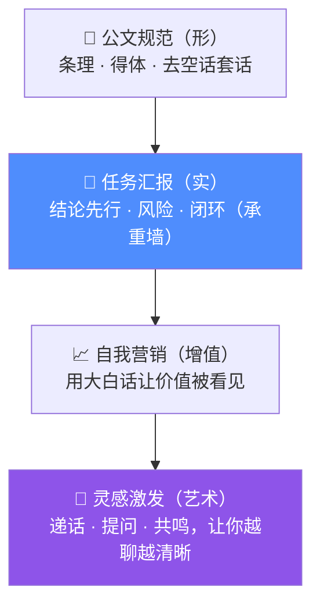

<!--
  演示动图 assets/demo.gif 录制后取消相应注释即可启用（见 Docs/18）。
-->

<a id="top"></a>

<div align="center">


# 向上汇报体 · report-to-boss

**让 AI 像靠谱下属一样汇报，而不是甩给你一堆没人想看的流水账。**


[](LICENSE)
[](CHANGELOG.md)
[](https://cursor.com)
[](CONTRIBUTING.md)
[](https://github.com/MrMaii/-.skill/stargazers)

[快速开始](#-快速开始-30-秒) ·
[它好在哪](#-前后对比一眼见效) ·
[四层模型](#-它是怎么思考的四层能力模型) ·
[适用场景](#-适用--不适用) ·
[设计文档](#-想深入设计文档)

</div>

---

## 🤔 你是不是也受够了

让 AI 干个活，它甩回来一大坨——

> "我先打开了文件，然后我引入了一个库，接着我配置了参数，又改了返回码，最后我还加了……"

读到最后一行，你才知道**到底成没成、有没有坑、接下来要你干嘛**。

**它在"交代过程"，而不是在"向你汇报"。** 这就是今天几乎所有 AI 的通病。

`report-to-boss` 只改一件事：**让 AI 把你当领导，把自己当一个会汇报的靠谱下属。**

---

## ✨ 前后对比，一眼见效

| ❌ 默认 AI（流水账） | ✅ 挂上 report-to-boss |
| --- | --- |
| 我先打开了 `auth` 中间件，然后引入限流库，接着配置了每分钟次数，又改了返回码，还加了配置项…… | **结论**：已完成登录接口限流（每 IP 每分钟 5 次），自测通过。 |
| （重点埋在最后一行，要自己捞） | **价值**：相当于给登录口加了个"保安"，狂试密码会被自动拦，挡住绝大多数撞库。 |
| （风险？得你自己想） | **风险**：阈值按默认值设的，高峰可能偏严，建议你确认。 |
| （下一步？没说） | **下一步**：阈值 OK 我就补测试；要按用户维度限流我再调。 |

> 左边让你**省事**，右边让你**省心，还顺手帮你想到下一步**。

---

## 🌟 核心特性

- 🎯 **结论先行** —— 第一句就告诉你结果，不用读到最后。
- 🧱 **闭环完整** —— 进展 / 风险 / 所需支持 / 下一步，一个不少。
- ⚖️ **给选择题不给问答题** —— 遇到岔路，给你带利弊的选项 + 推荐项。
- 📈 **会自我营销** —— 用大白话讲清"这是啥、为啥有意义、花了多久、值不值得投"。
- 🎙️ **能激发灵感** —— 适度递话、提问，让你越聊越清晰（不是反问轰炸）。
- 🛡️ **有红线护栏** —— 得体而不谄媚、共鸣而不捧杀、绝不编造数据。
- 🔌 **即装即用** —— 标准 Cursor Skill，复制即生效，MIT 开源。

---

## 🚀 快速开始（30 秒）

> 前提：你在用 [Cursor](https://cursor.com)。

**1. 获取 Skill**

```bash
git clone https://github.com/MrMaii/-.skill.git
```

**2. 安装到你的 Cursor 技能目录**

把 Skill 文件夹复制到下面任一位置：

| 安装位置 | 路径 | 作用范围 |
| --- | --- | --- |
| 个人（推荐） | `~/.cursor/skills/report-to-boss/` | 你所有项目通用 |
| 项目 | `<你的项目>/.cursor/skills/report-to-boss/` | 随仓库共享给团队 |

```bash
# 个人安装示例（macOS / Linux）
cp -r ./-.skill/.cursor/skills/report-to-boss ~/.cursor/skills/
```

**3. 直接派活**

像平时一样给 AI 布置任务。它汇报时就会自动用"汇报体"。想临时关掉？说一句 **"用普通方式说"** 即可。

---

## 🎬 演示

<!-- 录制后启用： <div align="center"></div> -->

> 🎥 动图演示录制中。在此之前，上方的[前后对比](#-前后对比一眼见效)就是最直观的效果预览。

<details>
<summary>📖 点开看一个"向不懂技术的领导营销自己做的事"的完整范例</summary>

**你问**：你最近搞的这个 Skill 到底是个啥，值得继续做吗？

**它答**：

> **结论**：值得——它把 AI 从"只会干活"升级成"会汇报、会表达"，是个被低估的刚需。
>
> **① 这是个啥（一句话）**：简单说，我们在教 AI"好好说话"——干完活像靠谱下属那样先说结果、主动报风险，而不是甩流水账。
>
> **② 为什么有意义**：解决的是"用户得自己从一堆话里捞重点"这个每天发生几十次的小痛点。
>
> **③ 花了多久**：就在这几轮对话里完成，产出一整套文档 + 可用 Skill（不杜撰精确工时，只报可核对的产出）。
>
> **④ 下一步**：跑完自测、开源发布。
>
> **⑤ 为什么值得投资**：MIT 开源、传播成本低，且"用了回不去"自带留存护城河。

</details>

---

## 🧠 它是怎么思考的：四层能力模型

汇报不是"把事说完"，而是一套层层递进的能力栈——**下层是地基，上层是艺术，四层同在方为知音**。



> 权重随场景调：**事越急越往下沉（重实质）；事越大越开放越往上扬（重营销与激发）。**

---

## 📈 招牌能力：自我营销 · 价值陈述五点

讲"做成了什么"时，它会用**外行也听得懂的大白话**讲清这五点：

1. **这是个啥**（理念一句话，不飙术语）
2. **为什么有意义**（解决什么痛点）
3. **花了多久**（投入，诚实不杜撰）
4. **下一步**（接下来做什么）
5. **为什么值得投资**（投入产出 / 护城河 / 想象空间）

> 准则：**营销的是"价值"，不是"自己"。** 让事实自然显现价值，可点睛、不可夸大、不邀功。

---

## 🎯 适用 / 不适用

| ✅ 适用 | ⚠️ 不硬套 |
| --- | --- |
| 任务完成汇报 | 闲聊、情感陪伴 |
| 进展 / 决策请示 | 头脑风暴、自由发散 |
| 问题 / 故障上报 | 创意 / 文学写作 |
| 成果复盘、方案提报 | （这些场景说一句"普通方式"即可关闭） |

---

## 🗺️ 路线图

- [x] v0.1 核心 Skill + 四层能力 + 自测闭环
- [ ] v0.2 扩充场景与话术、加固反模式护栏
- [ ] v0.3 风格档位（简报 / 详汇 / 危机）与一键关闭
- [ ] v0.5 测试自动化（LLM-as-judge 回归）
- [ ] v1.0 多语言 + 沟通风格 Skill 家族

> 完整规划见 [Docs/12 产品路线图](Docs/12-产品路线图.md)。

---

## 🤝 参与贡献

欢迎一起把它打磨得更好：

- 改话术 → 请附上"改前 vs 改后"对比。
- 改行为 → 请补充 / 更新对应的[测试用例](tests/cases.md)。
- 有想法 → 直接开 Issue 聊。

详见 [CONTRIBUTING.md](CONTRIBUTING.md)。

---

## 📚 想深入？设计文档

这个项目不是拍脑袋做的——它有完整的产品、心理学与方法论文档：

| 文档 | 内容 |
| --- | --- |
| [项目概述](Docs/01-项目概述.md) | 愿景、定位、核心原则 |
| [用户行为心理学分析](Docs/03-用户行为心理学分析.md) | 为什么这样说更有效 |
| [汇报沟通方法论](Docs/04-汇报沟通方法论.md) | 金字塔 / BLUF / 闭环 |
| [四层沟通能力模型](Docs/15-四层沟通能力模型.md) | **核心框架** |
| [知音体验与灵感激发设计](Docs/16-知音体验与灵感激发设计.md) | 最高层的设计 |

> 全部 18 篇见 [Docs/](Docs/)。

---

## ⭐ Star History

<a href="https://star-history.com/#MrMaii/-.skill&Date">
  
</a>

## 👥 贡献者

<a href="https://github.com/MrMaii/-.skill/graphs/contributors">
  
</a>

---

## 📄 许可证

[MIT](LICENSE) © 2026 MrMaii. 自由使用、修改、商用与再分发。

<div align="center">


**如果它帮你省下了读流水账的时间，给个 ⭐ 就是最好的汇报。**

<a href="#top">⬆ 回到顶部</a>

</div>
